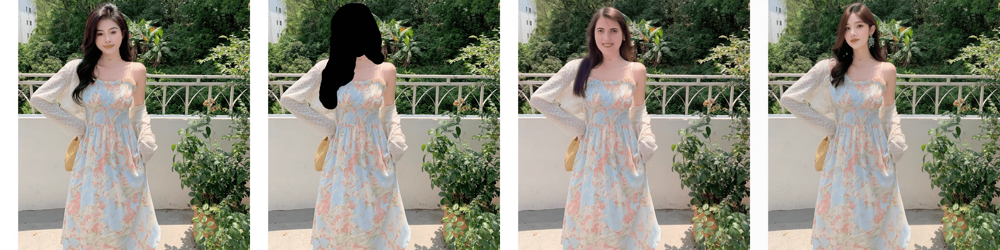

# SD3 ControlNet Inpainting


<center><i>a woman wearing a white jacket, black hat and black pants is standing in a field, the hat writes SD3</i></center>


<center><i>a person wearing a white shoe, carrying a white bucket with text "alibaba" on it</i></center>

Finetuned controlnet inpainting model based on sd3-medium, the inpainting model offers several advantages:

* Leveraging the SD3 16-channel VAE and high-resolution generation capability at 1024, the model effectively preserves the integrity of non-inpainting regions, including text.

* It is capable of generating text through inpainting.

* It demonstrates superior aesthetic performance in portrait generation.

Compared with [SDXL-Inpainting](https://huggingface.co/diffusers/stable-diffusion-xl-1.0-inpainting-0.1)

From left to right: Input image, Masked image, SDXL inpainting, Ours.


<center><i>a tiger sitting on a park bench</i></center>


<center><i>a dog sitting on a park bench</i></center>


<center><i>a young woman wearing a blue and pink floral dress</i></center>


<center><i>a woman wearing a white jacket, black hat and black pants is standing in a field, the hat writes SD3</i></center>


<center><i>an air conditioner hanging on the bedroom wall</i></center>

# How to Use

Dowanlod two python files：pipeline_sd3_controlnet_inpainting.py and controlnet_sd3.py can be found in the root directory of the current repo.

We will merge this Feature to official Diffusers.

``` python
from diffusers.utils import load_image, check_min_version
import torch

from pipeline_sd3_controlnet_inpainting import StableDiffusion3ControlNetInpaintingPipeline, one_image_and_mask
from controlnet_sd3 import SD3ControlNetModel

check_min_version("0.29.2")

# Build model
controlnet = SD3ControlNetModel.from_pretrained(
    "alimama-creative/SD3-Controlnet-Inpainting",
    use_safetensors=True,
)
pipe = StableDiffusion3ControlNetInpaintingPipeline.from_pretrained(
    "stabilityai/stable-diffusion-3-medium-diffusers",
    controlnet=controlnet,
    torch_dtype=torch.float16,
)
pipe.text_encoder.to(torch.float16)
pipe.controlnet.to(torch.float16)
pipe.to("cuda")

# Load image
image = load_image(
    "https://huggingface.co/alimama-creative/SD3-Controlnet-Inpainting/resolve/main/images/prod.png"
)
mask = load_image(
    "https://huggingface.co/alimama-creative/SD3-Controlnet-Inpainting/resolve/main/images/mask.jpeg"
)

# Set args
width = 1024
height = 1024
prompt="a woman wearing a white jacket, black hat and black pants is standing in a field, the hat writes SD3"
generator = torch.Generator(device="cuda").manual_seed(48)
input_dict = one_image_and_mask(image, mask, size=(width, height), latent_scale=pipe.vae_scale_factor, invert_mask = True)

# Inference
res_image = pipe(
    negative_prompt='deformed, distorted, disfigured, poorly drawn, bad anatomy, wrong anatomy, extra limb, missing limb, floating limbs, mutated hands and fingers, disconnected limbs, mutation, mutated, ugly, disgusting, blurry, amputation, NSFW',
    prompt=prompt,
    height=height,
    width=width,
    control_image= input_dict['pil_masked_image'],  # H, W, C,
    control_mask=input_dict["mask"] > 0.5,  # B,1,H,W
    num_inference_steps=28,
    generator=generator,
    controlnet_conditioning_scale=0.95,
    guidance_scale=7,
).images[0]

res_image.save(f'res.png')
```


## Training Detail

The model was trained on 12M laion2B and internal source images for 20k steps at resolution 1024x1024. 

* Mixed precision : FP16
* Learning rate : 1e-4
* Batch size : 192
* Timestep sampling mode : 'logit_normal'
* Loss : Flow Matching

## Limitation

Due to the fact that only 1024*1024 pixel resolution was used during the training phase, the inference performs best at this size, with other sizes yielding suboptimal results. We will initiate multi-resolution training in the future, and at that time, we will open-source the new weights.
